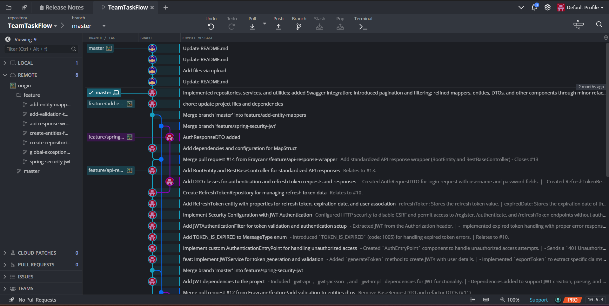

# Git ve GitHub Kullanım Rehberi

## Giriş

### Git Nedir?
- Dağıtık versiyon kontrol sistemi
- Kaynak kod yönetimi
- Takım çalışması için temel araç

### GitHub Nedir?
- Git tabanlı bulut platformu
- Kod paylaşım ve işbirliği merkezi
- Proje yönetim araçları

### Neden Git ve GitHub?
- Versiyon kontrolü
- Kod takibi
- Ekip çalışması
- Açık kaynak katkısı

Bu rehber, Git ve GitHub'ın temel ve ileri düzey kullanımını kapsar. Git, versiyon kontrol sistemi olarak kullanılırken, GitHub, Git projelerini depolamak ve paylaşmak için bir platformdur.

## Git Temel Kavramlar
### Git Çalışma Alanları
1. Working Directory (Çalışma Dizini)
   - Aktif olarak üzerinde çalışılan dosyalar
   - Henüz Git tarafından izlenmeyen değişiklikler

2. Staging Area (Hazırlık Alanı)
   - `git add` ile eklenen dosyalar
   - Commit için hazırlanan değişiklikler

3. Repository (Depo)
   - `git commit` ile kaydedilen değişiklikler
   - Projenin tüm versiyonları

### Git Durumları
- Untracked: Git tarafından izlenmeyen dosyalar
- Modified: Değiştirilmiş ama henüz stage edilmemiş
- Staged: Commit için hazır
- Committed: Local repository'de kayıtlı

## Temel Git Komutları

### Dosya ve Klasör İşlemleri
- `ls`: Bulunduğunuz dizindeki dosya ve klasörleri listeler.
- `pwd`: Bulunduğunuz dizinin tam yolunu gösterir.
- `cd <dosyaadı>`: Belirtilen dizine girer.
- `mkdir <klasöradi>`: Yeni bir klasör oluşturur.
- `touch <dosyaadı>`: Yeni bir dosya oluşturur.
- `rm <dosyaadı>`: Belirtilen dosyayı siler.
- `rm -rf <klasöradi>`: Belirtilen klasörü ve içindekileri siler.


### Git Konfigürasyonu
- `git config --global user.name "Kullanıcı Adı"`: Git kullanıcı adınızı ayarlar.
- `git config user.name`: Mevcut Git kullanıcı adını gösterir.
- `git config --global user.email "email@example.com"`: Git email adresinizi ayarlar.
- `git config user.email`: Mevcut Git email adresini gösterir.


### Git Temel Komutları

- `git init`: Mevcut dizini bir Git deposu olarak başlatır.
- `git status`: Git deposunun mevcut durumunu gösterir.
- `git add <dosyaadı>`: Belirtilen dosyayı staging alanına ekler.
- `git add .`: Tüm değişiklikleri staging alanına ekler.
- `git commit -m "Mesaj"`: Staging alanındaki değişiklikleri commitler.
- `git log`: Commit geçmişini gösterir.

### Branch İşlemleri
- `git branch`: Mevcut branch'leri listeler.
- `git branch <branchadı>`: Yeni bir branch oluşturur.
- `git switch <branchadı>`: Belirtilen branch'e geçer.
- `git merge <branchadı>`: Belirtilen branch'i mevcut branch ile birleştirir.

### Git Stash
- `git stash`: Değişiklikleri geçici olarak saklar.
- `git stash pop`: En son saklanan değişiklikleri geri yükler.
- `git stash list`: Saklanan değişiklikleri listeler.
- `git stash apply stash@{0}`: Belirli bir saklanan değişikliği geri yükler.
- `git stash clear`: Tüm saklanan değişiklikleri siler.

### Git Reset ve Revert
- `git reset <hash>`: Belirtilen commit'e kadar olan commit'leri siler, ancak dosyaları etkilemez.
- `git reset --hard <hash>`: Belirtilen commit'e kadar olan commit'leri ve dosyaları siler.
- `git revert <hash>`: Belirtilen commit'i geri alır ve yeni bir commit oluşturur.

### 3.2. Branch Birleştirme (Merge) Stratejileri

Git'te farklı branch'leri birleştirirken kullanabileceğimiz çeşitli stratejiler vardır. Her strateji farklı senaryolar için uygundur:

#### Fast-forward (Hızlı İleri)
- En basit ve otomatik strateji
- Ana branch'te hiç değişiklik yokken kullanılır
- Yeni commit oluşturmaz, sadece branch pointer'ını ilerletir
```bash
# Fast-forward merge örneği
git merge feature
```

#### Recursive (Özyinelemeli)
- En yaygın kullanılan strateji
- Her iki branch'te de değişiklik olduğunda kullanılır
- Yeni bir "merge commit" oluşturur
```bash
# Recursive merge örneği (no-ff ile zorlanabilir)
git merge --no-ff feature
```

#### Octopus (Ahtapot)
- İkiden fazla branch'i aynı anda birleştirir
- Büyük özellikleri birleştirirken kullanışlı
```bash
# Octopus merge örneği
git merge feature1 feature2 feature3
```

#### Ours (Bizimki)
- Çakışmaları otomatik çözer
- Current branch'in içeriğini korur
- Diğer branch'in değişikliklerini yok sayar
```bash
# Ours stratejisi örneği
git merge -s ours feature
```

#### Subtree (Alt Ağaç)
- Bir projeyi başka bir projenin alt dizini olarak birleştirir
- Modüler projeler için kullanışlı
```bash
# Subtree merge örneği
git merge -s subtree --prefix=lib feature
```

#### Ne Zaman Hangi Strateji?
1. **Fast-forward**: Basit feature branch'lerini birleştirirken
2. **Recursive**: Ekip çalışmalarında, paralel geliştirmelerde
3. **Octopus**: Çoklu feature branch'lerini tek seferde birleştirirken
4. **Ours**: Eski branch'leri arşivlerken veya çakışmaları hızlıca çözerken
5. **Subtree**: Alt projeler veya kütüphaneler eklerken

## Uzak Repository İşlemleri
### Remote Bağlantıları
```bash
# Remote ekleme
git remote add origin <url>

# Remote listeleme
git remote -v

# Remote silme
git remote remove <name>
```


### Push/Pull İşlemleri
```bash
# Değişiklikleri gönderme
git push origin <branch>

# Değişiklikleri alma
git pull origin <branch>

# Remote değişiklikleri kontrol
git fetch origin
```


### Git Diff
- `git diff`: Staging alanına eklenmemiş değişiklikleri gösterir.
- `git diff HEAD`: Son commit ile mevcut değişiklikler arasındaki farkı gösterir.
- `git diff <hash1> <hash2>`: İki commit arasındaki farkı gösterir.
- `git diff <branch1> <branch2>`: İki branch arasındaki farkı gösterir.

### Önemli Notlar
- Private repository'lerde push için yetki gerekir
- Conflict durumlarında manuel müdahale gerekebilir
- Branch isimlendirmelerinde anlamlı isimler kullanılmalı (örn: feature/login)
- Commit mesajları açıklayıcı olmalı
- Düzenli commit ve push yapılması önerilir

## GitHub İşlemleri

## GitHub İş Akışı (Workflow)

### 1. Temel İş Akışı
1. **Ana Branch (main)**
   - Çalışan kodu içerir
   - Direkt değişiklik yapılmaz
   - Her zaman stabil olmalı

2. **Geliştirme Süreci**
   ```bash
   # 1. Yeni branch oluştur
   git switch -c feature/yeni-ozellik

   # 2. Değişiklikleri yap ve kaydet
   git add .
   git commit -m "feat: Yeni özellik eklendi"

   # 3. GitHub'a gönder
   git push origin feature/yeni-ozellik
   ```

3. **Pull Request Süreci**
   - GitHub'da PR oluştur
   - Kod incelemesi iste
   - Testlerin geçmesini bekle
   - Onay sonrası birleştir

### 2. Örnek Senaryolar

#### Yeni Özellik Geliştirme
```bash
# 1. Ana branch'i güncelle
git switch main
git pull

# 2. Yeni branch oluştur
git switch -c feature/login

# 3. Geliştirme yap ve kaydet
git add .
git commit -m "Login sayfası eklendi"

# 4. GitHub'a gönder
git push origin feature/login
```

#### Hata Düzeltme
```bash
# 1. Hata düzeltme branch'i
git switch -c fix/login-hatasi

# 2. Düzeltme yap ve kaydet
git commit -m "fix: Login hatası düzeltildi"

# 3. GitHub'a gönder
git push origin fix/login-hatasi
```

### 3. GitHub Actions Basit Örnekler

#### Otomatik Test
```yaml
name: Test
on: [push]
jobs:
  test:
    runs-on: ubuntu-latest
    steps:
      - uses: actions/checkout@v2
      - name: Run Tests
        run: npm test
```

#### Otomatik Deploy
```yaml
name: Deploy
on:
  push:
    branches: [main]
jobs:
  deploy:
    runs-on: ubuntu-latest
    steps:
      - name: Deploy
        run: npm run deploy
```

### 4. Proje Yönetimi İpuçları

#### Etkili Issue Kullanımı
- Başlık açıklayıcı olmalı
- Detaylı açıklama ekle
- Etiketleri kullan (bug, feature vb.)
- İlgili kişileri etiketle

#### Pull Request Best Practices
- Küçük ve odaklı değişiklikler
- Açıklayıcı başlık ve açıklama
- Ekran görüntüleri ekle
- Test sonuçlarını belirt


### GitHub Repo Oluşturma ve Yönetme
- `git remote add origin <URL>`: GitHub deposunu yerel depoya bağlar.
- `git push -u origin <branchadı>`: Yerel branch'i GitHub'a yükler.
- `git push origin <branchadı>`: Belirtilen branch'i GitHub'a yükler.
- `git fetch origin <branchadı>`: GitHub'daki değişiklikleri yerel depoya getirir.
- `git pull origin <branchadı>`: GitHub'daki değişiklikleri yerel depoya getirir ve birleştirir.
- `git clone <URL>`: GitHub deposunu yerel bilgisayara klonlar.


## Conflict (Çakışma) Yönetimi

### 1. Conflict Nedir?
- Aynı dosyanın aynı kısmında farklı değişiklikler olduğunda ortaya çıkar
- Git otomatik birleştirme yapamaz
- Manuel müdahale gerektirir

### 2. Conflict Çözme Adımları
```bash
# 1. Güncel main branch'i al
git switch main
git pull

# 2. Feature branch'ini main ile güncelle
git switch feature/login
git merge main

# 3. Conflict durumunda dosyaları düzenle
# Conflict işaretleri:
<<<<<<< HEAD
şu anki branch'teki kod
=======
diğer branch'teki kod
>>>>>>> main

# 4. Çözülen conflict'leri kaydet
git add .
git commit -m "fix: Login conflict çözüldü"
```

### 3. Conflict Önleme Yöntemleri
- Sık sık main branch ile senkronize ol
- Küçük ve odaklı değişiklikler yap
- Takım içi iletişimi güçlü tut
- Branch isimlendirmelerini standart yap

### 4. IDE Conflict Çözüm Araçları
- VS Code: Built-in merge editor
- IntelliJ: Visual merge tool
- SourceTree: Built-in conflict resolver

### 5. Örnek Conflict Senaryosu
```bash
# Senaryo: İki geliştirici aynı dosyayı değiştirdi

# Geliştirici 1:
git switch -c feature/login-tasarim
# login.css değişiklikleri
git commit -m "Login sayfası tasarımı güncellendi"
git push origin feature/login-tasarim

# Geliştirici 2:
git switch -c feature/login-responsive
# login.css değişiklikleri
git commit -m "Login sayfası responsive yapıldı"
git push origin feature/login-responsive

# Conflict Çözümü:
git switch feature/login-responsive
git merge feature/login-tasarim
# Conflict çözme editörü açılır
# Değişiklikleri manuel birleştir
git add .
git commit -m "merge: Login tasarım ve responsive birleştirildi"
```


## GitHub Özellikleri

### 1. Issues (Sorunlar)
Issues, projenizde karşılaşılan sorunları, yapılacak işleri ve özellik isteklerini yönetmenizi sağlar:
- **Sorun Takibi**: Bug'ları ve hataları raporlama
- **Görev Yönetimi**: Yapılacak işleri listeleme ve atama
- **Özellik İstekleri**: Yeni özellik önerilerini toplama
- **Etiketleme**: `bug`, `feature`, `documentation` gibi etiketlerle organize etme

### 2. Pull Requests (PR)
Kod değişikliklerini gözden geçirme ve birleştirme sürecini yönetir:
- **Kod İnceleme**: Değişiklikleri inceleme ve yorum yapma
- **Otomatik Kontroller**: Testlerin ve kontrollerin otomatik çalıştırılması
- **Branch Birleştirme**: Onaylanan değişiklikleri ana branch'e alma
- **Code Review**: Ekip üyelerinin kodu incelemesi ve onaylaması

### 3. Actions (Otomatizasyon)
GitHub Actions, iş akışlarını otomatize etmenizi sağlar:
```yaml
# Örnek GitHub Action
name: Test ve Deploy
on: [push]
jobs:
  test:
    runs-on: ubuntu-latest
    steps:
      - name: Testleri Çalıştır
        run: npm test
  deploy:
    needs: test
    runs-on: ubuntu-latest
    steps:
      - name: Deploy
        run: npm run deploy
```
- **CI/CD**: Sürekli entegrasyon ve dağıtım
- **Otomatik Testler**: Her push'ta testlerin çalıştırılması
- **Deployment**: Başarılı testler sonrası otomatik dağıtım

### 4. Projects (Proje Yönetimi)
Proje yönetimi için kapsamlı araçlar sunar:
- **Kanban Boardları**: 
  - To Do (Yapılacak)
  - In Progress (Devam Eden)
  - Done (Tamamlanan)
- **Milestone Takibi**: 
  - Sürüm planlaması
  - İlerleme takibi
  - Deadline yönetimi
- **Otomatizasyon**: 
  - Issue'ların otomatik atanması
  - PR'ların otomatik bağlanması
  - Durum güncellemeleri

### Örnek Kullanım Senaryosu:
1. Yeni bir özellik için **Issue** oluşturulur
2. Issue için bir **Branch** açılır
3. Geliştirme yapılır ve **Pull Request** açılır
4. **GitHub Actions** testleri çalıştırır
5. Kod review yapılır ve onaylanır
6. **Projects** board'unda ilerleme takip edilir
7. **Milestone**'a eklenir ve deadline belirlenir

### Pull Request ve Fork
- **Pull Request**: GitHub'da bir branch'de yapılan değişiklikleri ana branch ile birleştirmek için istek gönderme.
- **Fork**: Bir GitHub deposunu kendi hesabınıza kopyalama.

### GitHub Özellikleri
- **Actions**: DevOps işlemleri için otomatik iş akışları oluşturma.
- **Projects**: Proje yönetimi için araçlar.
- **README.md**: Proje hakkında bilgi içeren markdown dosyası.

## İleri Düzey Git Komutları

### Git Rebase
- `git rebase <branchadı>`: Mevcut branch'i belirtilen branch üzerine yeniden dizerek merge commit'lerini temizler.

### Git Checkout
- `git checkout <hash>`: Belirtilen commit'e geçer.
- `git checkout origin/<branchadı>`: GitHub'daki bir branch'e geçer.

### Git Remote
- `git remote`: Bağlı uzak depoları listeler.

## Örnek Kullanım Senaryoları

### Yeni Bir Proje Oluşturma ve GitHub'a Yükleme
1. Yerel dizinde `git init` komutu ile yeni bir Git deposu oluşturun.
2. Dosyaları oluşturun ve `git add .` ile staging alanına ekleyin.
3. `git commit -m "İlk commit"` ile değişiklikleri commitleyin.
4. GitHub'da yeni bir repo oluşturun ve URL'sini alın.
5. `git remote add origin <URL>` ile GitHub deposunu yerel depoya bağlayın.
6. `git push -u origin main` ile yerel depoyu GitHub'a yükleyin.

### Branch Oluşturma ve Birleştirme
1. `git branch feature` ile yeni bir branch oluşturun.
2. `git switch feature` ile yeni branch'e geçin.
3. Değişiklikleri yapın ve `git commit -m "Yeni özellik"` ile commitleyin.
4. `git switch main` ile ana branch'e geçin.
5. `git merge feature` ile feature branch'ini ana branch ile birleştirin.

### GitHub'dan Proje Klonlama ve Değişiklik Yapma
1. `git clone <URL>` ile GitHub deposunu yerel bilgisayara klonlayın.
2. Yeni bir branch oluşturun ve değişiklikleri yapın.
3. Değişiklikleri commitleyin ve `git push origin <branchadı>` ile GitHub'a yükleyin.
4. GitHub'da Pull Request oluşturarak değişiklikleri ana branch ile birleştirin.


## İleri Düzey Git Kullanımı ve Senaryolar

### Git Rebase ile Tarih Temizleme
`git rebase`, branch'lerinizi daha temiz bir commit geçmişi ile yeniden düzenlemenizi sağlar. Özellikle uzun süren feature branch'lerinde, `merge` yerine `rebase` kullanarak commit geçmişinizi daha anlaşılır hale getirebilirsiniz.

**Örnek Senaryo:**
1. `git switch feature` ile feature branch'ine geçin.
2. `git rebase main` komutunu çalıştırın. Bu, feature branch'inizi main branch üzerine yeniden dizerek commit geçmişini temizler.
3. Eğer çakışmalar (conflict) oluşursa, çakışmaları çözün ve `git rebase --continue` ile devam edin.

### Git Cherry-Pick ile Belirli Commit'leri Taşıma
`git cherry-pick`, belirli bir commit'i başka bir branch'e taşımak için kullanılır. Bu, özellikle bir branch'te yapılan bir düzeltmeyi başka bir branch'e uygulamak istediğinizde kullanışlıdır.

**Örnek Senaryo:**
1. `git log` ile commit hash'ini bulun.
2. `git switch main` ile ana branch'e geçin.
3. `git cherry-pick <hash>` komutunu çalıştırarak belirli commit'i ana branch'e taşıyın.

### Git Bisect ile Hata Bulma
`git bisect`, projenizdeki bir hatayı hangi commit'in tanıttığını bulmak için kullanılır. Bu, özellikle büyük projelerde hata ayıklama sürecini hızlandırır.

**Örnek Senaryo:**
1. `git bisect start` ile bisect modunu başlatın.
2. `git bisect bad` ile mevcut commit'in hatalı olduğunu belirtin.
3. `git bisect good <hash>` ile hatanın olmadığı bir commit'i işaretleyin.
4. Git, otomatik olarak commit'ler arasında gezinerek hatayı bulmanıza yardımcı olur.

### Git Hooks ile Otomasyon
Git hooks, belirli Git olayları (örneğin, commit, push) sırasında otomatik olarak çalıştırılacak script'lerdir. Bu, kod kalitesini artırmak veya belirli işlemleri otomatize etmek için kullanılabilir.

**Örnek Senaryo:**
1. `.git/hooks` dizinine gidin.
2. `pre-commit` adında bir dosya oluşturun ve içine çalıştırılacak script'i yazın.
3. Script'i çalıştırılabilir hale getirin (`chmod +x pre-commit`).

### GitHub Actions ile CI/CD
GitHub Actions, GitHub repo'larınız için sürekli entegrasyon (CI) ve sürekli dağıtım (CD) işlemlerini otomatize etmenizi sağlar. Bu, testleri otomatik olarak çalıştırmak veya kodunuzu otomatik olarak dağıtmak için kullanılabilir.

**Örnek Senaryo:**
1. `.github/workflows` dizinine bir YAML dosyası oluşturun.
2. İş akışını tanımlayın (örneğin, her push'ta testleri çalıştırma).
3. GitHub, otomatik olarak bu iş akışını çalıştıracaktır.


## Sık Kullanılan Git Senaryoları

### 1. Yanlış Branch'te Çalışma Yapıldığında
```bash
# 1. Değişiklikleri geçici kaydet
git stash

# 2. Doğru branch'e geç
git switch doğru-branch

# 3. Değişiklikleri geri al
git stash pop
```

### 2. Son Commit'i Düzeltme
```bash
# Commit mesajını düzeltme
git commit --amend -m "Yeni commit mesajı"

# Son commit'e dosya ekleme
git add unutulan-dosya
git commit --amend --no-edit
```

### 3. Commit'leri Birleştirme
```bash
# Son 3 commit'i birleştirme
git rebase -i HEAD~3

# Açılan editörde:
pick en-eski-commit
squash orta-commit
squash son-commit
```

### 4. Branch Temizliği
```bash
# Birleştirilmiş branch'leri listeleme
git branch --merged

# Birleştirilmiş branch'leri silme
git branch -d birleştirilmiş-branch

# Remote'dan silinmiş branch'leri temizleme
git remote prune origin
```

### 5. Geçici Değişiklikler
```bash
# Geçici değişiklikleri kaydetme
git stash save "login bug fix"

# Belirli dosyaları stash'leme
git stash push -m "css changes" style.css

# Stash listesini görüntüleme
git stash list

# Son stash'i uygulama ve silme
git stash pop

# Belirli bir stash'i uygulama
git stash apply stash@{2}
```

### 6. Hataları Geri Alma
```bash
# Stage edilmemiş değişiklikleri geri alma
git checkout -- hatalı-dosya.txt

# Stage edilmiş değişiklikleri geri alma
git reset HEAD hatalı-dosya.txt

# Son commit'i geri alma (değişiklikleri koru)
git reset --soft HEAD^

# Son commit'i tamamen silme
git reset --hard HEAD^
```

### 7. Branch İşlemleri
```bash
# Branch oluştur ve geç
git switch -c yeni-özellik

# Remote branch'i yerel branch olarak alma
git switch -c yerel-branch origin/uzak-branch

# Branch'i yeniden adlandırma
git branch -m eski-isim yeni-isim

# Branch'i silme (zorla)
git branch -D silinecek-branch
```

### 8. Commit Geçmişi İşlemleri
```bash
# Detaylı log görüntüleme
git log --oneline --graph --all

# Belirli dosyanın geçmişini görme
git log -p dosya.txt

# Belirli tarih aralığındaki commit'ler
git log --since="1 week ago"
git log --before="2023-12-31"

# Author'a göre filtreleme
git log --author="kullanıcı"
```

### 9. Remote İşlemleri
```bash
# Remote branch'leri görüntüleme
git remote show origin

# Yeni remote ekleme
git remote add upstream https://github.com/orijinal/repo.git

# Remote branch'i silme
git push origin --delete uzak-branch

# Tüm remote branch'leri çekme
git fetch --all
```

### 10. Merge ve Rebase İpuçları
```bash
# Merge işlemini iptal etme
git merge --abort

# Rebase işlemini iptal etme
git rebase --abort

# Conflict sonrası devam etme
git merge --continue
git rebase --continue

# Branch'i güncel tutma
git pull --rebase origin main
```

### 11. Dosya İşlemleri
```bash
# Dosyaları takipten çıkarma
git rm --cached gereksiz-dosya.txt

# Dosyaları taşıma/yeniden adlandırma
git mv eski-dosya.txt yeni-dosya.txt

# Belirli bir commit'teki dosyayı görüntüleme
git show commit-hash:dosya.txt

# İki branch arasındaki dosya farklarını görme
git diff branch1..branch2 -- dosya.txt
```

### 12. Etiketleme ve Sürüm Yönetimi
```bash
# Lightweight tag oluşturma
git tag v1.0.0

# Annotated tag oluşturma
git tag -a v1.0.0 -m "Version 1.0.0 release"

# Tag'leri listeleme
git tag --list

# Tag'i push etme
git push origin v1.0.0
```

## GUI Araçları ve IDE Entegrasyonu

## Sonuç

Bu rehber, Git ve GitHub'ın temel ve ileri düzey kullanımını kapsar. GUI araçları ve IDE entegrasyonu ile Git kullanımı daha kolay hale gelirken, ileri düzey tekniklerle projelerinizi daha etkili bir şekilde yönetebilirsiniz. 

### GitHub Desktop
GitHub Desktop, GitHub ile etkileşimde bulunmak için kullanılan bir GUI aracıdır. Bu araç, Git komutlarını kullanmadan repo'ları yönetmenizi, commit'leri oluşturmanızı ve branch'leri birleştirmenizi sağlar.


### Kraken
Kraken, Git repo'larını yönetmek için kullanılan bir diğer GUI aracıdır. Bu araç, Git komutlarını kullanmadan repo'ları yönetmenizi, commit'leri oluşturmanızı ve branch'leri birleştirmenizi sağlar.



### IDE Entegrasyonu
Modern IDE'ler (IntelliJ IDEA, Visual Studio Code, Eclipse vb.), Git entegrasyonu sunar. Bu entegrasyon, Git komutlarını kullanmadan repo'ları yönetmenizi, commit'leri oluşturmanızı ve branch'leri birleştirmenizi sağlar.


Bu rehber, Git ve GitHub'ın temel ve ileri düzey kullanımını kapsar. 

Daha fazla bilgi için [Git Resmi Dokümantasyonu](https://git-scm.com/doc) ve [GitHub Docs](https://docs.github.com/)'u ziyaret edebilirsiniz.